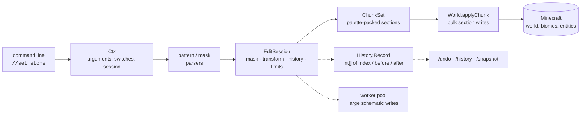

<div align="center">

# FAWE-BIM

**FastAsyncWorldEdit — but in mods**

The complete **WorldEdit 7.3.17** + **FastAsyncWorldEdit** command set, running as a standalone
**Fabric** mod for **Minecraft 1.21.10**. No plugin, no server software, no client mod, no
placeholder commands.

[](LICENSE.txt)
[](https://www.minecraft.net/)
[](https://fabricmc.net/)
[](https://modrinth.com/mod/fabric-api)
[](https://adoptium.net/)

[](https://github.com/MaxLananas/FAWE-ButInMods/actions/workflows/build.yml)
[](docs/STATUS.md)
[](docs/COMMANDS.md)
[](docs/COMMANDS.md)
[](docs/COMMANDS.md)
[](scripts/flag_audit.py)
[](docs/STATUS.md)

[](https://github.com/MaxLananas/FAWE-ButInMods/commits)
[](https://github.com/MaxLananas/FAWE-ButInMods/commits)
[](https://github.com/MaxLananas/FAWE-ButInMods/issues)
[](CONTRIBUTING.md)
[](https://github.com/MaxLananas/FAWE-ButInMods/stargazers)

[Install](#install) · [Commands](docs/COMMANDS.md) · [Status](docs/STATUS.md) ·
[Contributing](CONTRIBUTING.md) · [Code of conduct](CODE_OF_CONDUCT.md)

</div>

---

## Table of contents

| | |
|---|---|
| [What this is](#what-this-is) | What you get, in one screen |
| [Install](#install) | Requirements and setup |
| [Quick tour](#quick-tour) | The commands you will type first |
| [Feature matrix](#feature-matrix) | Everything the mod covers, group by group |
| [How it works](#how-it-works) | The engine, why it is fast, and the measured throughput |
| [Status](#status) | Live numbers, always generated from the registry |
| [Known platform limits](#known-platform-limits) | What a mod cannot do that a plugin can |
| [Development](#development) | Build, test, regenerate the docs, continuous integration |
| [Project layout](#project-layout) | Where things live |
| [Credits and licence](#credits-and-licence) | Upstream projects and attribution |

## What this is

FAWE-BIM ports the WorldEdit and FastAsyncWorldEdit feature set to a single Fabric mod. Everything
a WorldEdit player expects is here, and it runs in singleplayer as well as on a dedicated server:

| | |
|---|---|
| **Commands** | The full `//` and `/` namespaces: `//set`, `//copy`, `//paste`, `//brush`, `/tool`, `/schem`, `/snapshot`, `/we`, `/anvil`, and 255 of 255 upstream names |
| **Selections** | Cuboid, polygon, ellipsoid, sphere, cylinder, convex polyhedron, extend, fuzzy — plus the wand and position limits |
| **Masks & patterns** | `#`/`%`/`##`/`|`/`~`/`{`/`/` mask parsers, `#nx`/`*`/`$`/`#mask`/`#buffer` patterns, `//gmask`, `//gsmask`, angle and expression masks |
| **Clipboards** | Sponge v1/v2/v3, MCEdit `.schematic`, structure `.nbt`; entities, biomes and structure voids survive a copy |
| **Brushes** | 46 brushes with FAWE's arguments and switches, saved as presets, bound per hand |
| **Tools** | Tools, super-pickaxe modes, feature/structure placers, mouse-wheel scroll bindings |
| **Chunk tools** | `/anvil` reads the dimension's region files to decide what qualifies, then edits the chunks through the server |
| **History** | Undo/redo, per-chunk change sets, an edit log behind `/history find|rollback|restore`, and `/snapshot` archives |
| **Engine** | Palette-packed sections, bulk chunk writes, deferred side effects, operation timeouts, block-change limits, worker-pool writes for large schematics |

> [!NOTE]
> The engine (`core/`) has **no Minecraft types at all**. It talks to the game through
> `BlockStateRegistry` and `World`, which the Fabric adapter (`fabric/`) implements — which is why
> the whole editing engine, including its 472-test suite, runs without launching Minecraft.

## Install

| Component | Version |
|---|---|
| Minecraft | **1.21.10** |
| Fabric Loader | 0.17.3 or newer |
| [Fabric API](https://modrinth.com/mod/fabric-api) | 0.136.0+1.21.10 or newer |
| Java | 21 |

1. Install **Fabric Loader** for **Minecraft 1.21.10**.
2. Drop [Fabric API](https://modrinth.com/mod/fabric-api) and the FAWE-BIM jar into `.minecraft/mods`.
3. Launch the game.

The mod works in singleplayer and on a Fabric server. Its configuration is written to
`config/fawebim.yml` on first start, and every value in it is editable from the chat, so a change
never needs a restart. In game, `/fawebim` opens a settings screen: a group list on the left, a row
per setting with the editor for its type (a switch, a number with `-`/`+`, a text field), a search
box, a Reset button per row, and a line telling you what the setting under the cursor does. It is a
`Screen` of the game itself, so it needs no extra library, no downloadable native code, and it works
wherever the mod does.

```text
/fawebim                           open the settings screen (chat listing without a client)
/fawebim settings                  list every setting with its current value
/fawebim settings wand             show the settings whose name matches
/fawebim set max-brush-radius 50   change one and write the file
/fawebim reset max-brush-radius    put one back to the value the mod ships with
/fawebim reload                    pick up a file edited by hand

Tab completes all of it: the actions, then the keys, then the values a key
accepts -- `true`/`false` for a switch, the value it holds now for anything else.
Asking for a value without giving one tells you both.
```

The file only holds settings the mod actually reads: the audits in `scripts/` fail the build when a
configuration key does nothing, so no knob lies about its effect. Schematics live in `schematics/`
and diagnostics reports in `fawe-reports/`, both relative to the game directory.

Build the jar yourself with `./gradlew build` — it lands in `fabric/build/libs/FAWE-BIM-<version>.jar`.

## Quick tour

Both spellings of every command work, because Minecraft strips one slash from what you type
(`//set` reaches the command registered as `/set`).

```text
//wand                        give yourself the selection wand
//pos1  //pos2                set the corners (or left/right click with the wand)
//set stone                   fill the selection
//replace stone,dirt grass_block
//copy  //paste -a            clipboard, keeping the blocks the clipboard's air covers
//schem save house -f         schematics in ./schematics
//sphere glass 15             shapes: //sphere, //cyl, //pyramid, //cone, //line, //spline, ...
//brush sphere stone 5        bind a brush to the held item (pattern first, like FAWE)
//brush clipboard -a -m #existing
//tool tree                   bind a tool to the held item
/tool mask #existing         brush settings: mask, material, range, size, tracemask, transform
/tool material -h stone      the same settings for the brush in the offhand
//undo  //redo                history
/history find -u Steve -t 2h the edits of the last two hours, by any player name starting with Steve
//regen                       regenerate the selected chunks
//generatebiome desert abs(x) < 20
```

Selection outlines are drawn by the mod itself with server-side particles, so a vanilla client
needs nothing beyond Fabric API.

## Feature matrix

| Group | Count | Highlights |
|---|---:|---|
| Region | 46 | `//set`, `//replace`, `//walls`, `//faces`, `//hollow`, `//overlay`, `//smooth`, `//distr`, `//count`, `//size`, `//expand`, `//contract`, `//shift` |
| Generation | 24 | `//sphere`, `//cyl`, `//pyramid`, `//cone`, `//line`, `//spline`, `//image`, `//ores`, `//caves`, `//forestgen`, `//generatebiome`, `//feature`, `//structure` |
| Brush | 51 | Sphere, cylinder, smooth, blendball, terrain (`height`, `cliff`, `flatten`, `heightmap`), clipboard, copypaste, catenary, stencil, scatter, spline, gravity, recurse, butcher, … |
| Tool | 24 | `/tool` bindings, super-pickaxe, `farwand`, `lrbuild`, `deltree`, `tree`, `inspect`, scroll actions |
| Clipboard | 14 | `//copy`, `//cut`, `//paste`, `//rotate`, `//flip`, `//stack`, `//move`, `//place`, lazy copy/cut |
| Selection | 19 | `//sel` for six selector types, `//pos1`, `//pos2`, `//hpos1`, `//hpos2`, `//wand`, `//drawsel`, `//chunk` |
| Anvil | 21 | `clear`, `copy`, `paste`, `count`, `countall`, `distr`, `replace*`, `removelayers`, `trimallair`, `trimallplots`, `deletebiomechunks`, `deleteallunvisited`, `deleteunclaimed`, … |
| Navigation | 8 | `/nav`, `/up`, `/ceil`, `/descend`, `/thru`, `/unstuck`, `/jumpto`, `/ascend` |
| Utility | 25 | `/worldedit`, `/we`, `/brush`, `/tool`, `/we report`, `/searchitem`, `/calculate`, `//registry`, `//cancel` |
| History | 4 | `//undo`, `//redo`, `/history list|find|rollback|restore` |
| Snapshot | 6 | `/snapshot list|use|before|after|sel|restore` |
| Chunk | 4 | `//listchunks`, `//delchunks`, `//chunk`, `//regen` |
| Biome | 5 | `//setbiome`, `//biomelist`, `//biomeinfo` |
| Schematic | 2 | `//schem` with `list`, `save`, `load`, `loadall`, `move`, `delete`, `formats` |

The exhaustive list — every command, its aliases, arguments, switches and status — is generated from
the live registry into [`docs/COMMANDS.md`](docs/COMMANDS.md), with the machine-readable form in
[`docs/commands-spec.json`](docs/commands-spec.json).

## How it works



Three ideas do most of the work:

| Idea | What it buys |
|---|---|
| **Chunk buffering** | Writes land in per-chunk buffers instead of touching the world block by block, then flush in one batch per chunk. |
| **Packed sections** | History and clipboards store a 16³ section as parallel `int[]` arrays plus a palette, so a million-block edit costs megabytes, not a list of boxed objects. |
| **Deferred side effects** | Lighting and neighbour updates are collected per changed position and applied once, on the server thread, after the edit. |

### Measured throughput

`./gradlew :core:bench` prints the same table on your machine: an in-JVM world of
256x256x128 blocks, single-threaded, best of seven runs after warm-up. The numbers below are the
range several runs of it produced on one machine, and are only meant as a floor and as a way to see
what a change costs.

| Operation | Rate |
|---|---|
| Block writes, engine with history | **30 – 33 M blocks/s** |
| Block writes, engine without history | **57 – 59 M blocks/s** |
| `//set` over 64x64x64 | **42 M blocks/s** |
| `//copy` over 64x64x64 | **70 – 74 M blocks/s** |
| `//paste` over 64x64x64 | **31 – 32 M blocks/s** |
| `//replace` over 64x64x64 | **30 – 31 M blocks/s** |
| `//sphere` radius 40 | **41 M blocks/s** |
| `//undo` and `//redo` of that `//set` | **69 – 79 M blocks/s** |
| A mask asked about a block | **262 – 294 M questions/s** |

The spread between two runs of the same binary is wider than the effect of most
changes, so a single number would be a claim the benchmark cannot support: what the
table says is what the operations cost, not what a machine will measure. A row runs
ten times and every run records a history of its own, so the bench drops the history
of the run before it: keeping them would have the row measure the heap, which on a
machine with a gigabyte to spare means measuring the garbage collector.

Every row prepares the world with the state the edit is about to overwrite, because an edit that
finds the value already there returns before it does anything and a benchmark of that measures
nothing.

The shape of that came from measuring rather than guessing. A profile of the write path found a
fifth of an edit inside the palette and a tenth inside the boxed keys of the history map, and both
are gone: the palette answers a repeated state from the last write, the history keys its chunk
sections by primitive key, a change set grows in eighths rather than halves, and a chunk buffer
write asks "was this cell written, what did it hold, write it" in one call instead of three that
each redid the arithmetic. A mask is asked about every block of a filtered edit, and a block that
matches nothing used to pay for a name lookup every time; the mask remembers the states it rejected,
which took a question from 13 ns to 3.0.

The earlier passes were the same kind of work. The palette used to walk its entries one by one
(487 ns per block on a build with four thousand block states, 3.7 after). Masks held their states in
a `Set<Integer>`, and every brush built a list of positions before touching one. The chunk buffer
kept the positions it held in a hash set, so every write hashed a position and every flush asked
4096 times per section whether a cell was in that set: it keeps one bit per cell now, and the flush
walks the bits that are set. The edit timeout counted blocks with an atomic and read the clock on
every one of them; it reads the clock once every 512 blocks. Each of those is a plain array, a bit
or a primitive-keyed table today, and the same pass took the position objects out of the region
walks that `//set`, `//paste`, `//move` and the brushes run per block. `//paste` built a position
object for every cell of the clipboard and looked each one up by position afterwards; it walks the
clipboard and takes the state of each cell as it goes now, which is why it went from a little over
half the rate of `//set` to the same rate. Copying with biomes read the biome of every block of the
selection and stored all of them, sixty-four identical entries for one cell of a world that keeps
its biomes per 4x4x4 cell; it samples the cells now.

## Status

| | |
|---|---|
| Engine tests | **472 passing, 0 failing** (`./gradlew :core:selfTest`) |
| Commands registered | **266** |
| Implemented | **247** |
| Aliases of an implemented command | **20** |
| Brushes with their upstream signature | **46** |
| Command switches upstream declares but this build lacks | **0** |
| Flags declared but never read | **0** |
| Settings in `config/fawebim.yml` | **39, all read by the code** |
| Registered, behaviour still to port | **0** |
| WorldEdit + FAWE command names that resolve | **255 / 255** |

Every name WorldEdit 7.3.17 and FastAsyncWorldEdit declare is registered and resolves, with no stub
left in the registry. `./gradlew :core:verify` runs the self-tests and then feeds the 255 declared
commands and their 201 aliases (457 spellings in total) to the same lookup the dispatcher uses, so a
name cannot quietly stop working.

Every command switch upstream declares is declared here too, with the same kind, and every one of
them is read by the code that implements it: `scripts/flag_audit.py` compares the command surface
with upstream and the brush table with the brush factory, and currently reports nothing missing,
nothing taking the wrong kind of value, and no brush flag the factory ignores. The same idea covers
the configuration: `scripts/settings_audit.py` reads the declaration table of the config and fails
when a key is not read anywhere else, so a setting that does nothing cannot ship. The settings that
only a server has a use for (`queue.tick-interval`, `extent.extended-y-limit`, lightning and entity
caps) are not offered at all rather than shown as knobs that pretend to work.

## Known platform limits

A few upstream features need something a standalone Fabric mod does not have. Where that is the
case, the command says so instead of failing silently.

> [!IMPORTANT]
> **CraftScripts** (`//cs`, `//.s`) run through a JSR-223 engine. Modern JVMs ship none, so the
> command reports that no engine is available rather than pretending the script ran.

> [!NOTE]
> **Custom regeneration seeds** (`//regen <seed>`) need a second chunk source. Minecraft builds one
> from the level seed, so the command regenerates with the world seed and tells the player the seed
> was ignored. `-b` (regenerate biomes) works: the adapter keeps the biome grid when it is absent.

> [!NOTE]
> **`/anvil`** reads the dimension's region files (read-only) to decide which chunks qualify, then
> edits those chunks through the server. Rewriting region files behind a running server is what made
> FAWE's own anvil commands unsafe, and is deliberately not done.

> [!NOTE]
> **Claim checks** in `/anvil deleteunclaimed` and `/anvil trimallplots` need a claim provider
> (WorldGuard, PlotSquared, GriefPrevention). FAWE asks one; a mod has none to ask, so the chunk age
> test decides on its own and the report says the claim check was skipped.

> [!NOTE]
> **CUI** (`/cui`) targets FAWE's client mod, which a vanilla client does not run; the command
> reports the state it would advertise.

## Development

Prerequisites: **JDK 21**. Gradle, Loom, Minecraft, the Parchment mappings and Fabric API are
fetched automatically; the wrapper pins the Gradle release the Loom plugin of this version asks for,
so a fresh checkout builds without touching the toolchain.

```bash
./gradlew :core:selfTest      # engine test suite, no Minecraft required
./gradlew :core:verify        # self-tests + every upstream command name through the dispatcher
./gradlew build               # core + Fabric mod
./gradlew :fabric:runClient   # test client
./gradlew :fabric:runServer   # test server
./gradlew :core:genDocs       # regenerate docs/ from the live command registry
python3 scripts/generate_command_tables.py   # after changing the command set
python3 scripts/flag_audit.py                # compare the flags with upstream
```

The documentation is generated *from the registry*, never written by hand, so it cannot drift from
the implementation. The command tables (`SubCommandTable`, `StubTable`, `BrushTable`) are generated
from `docs/commands-inventory.json`, which is itself extracted from the upstream sources, and from
the registry dump — that is how the project tracks which WorldEdit/FAWE commands are ported and
which are still missing.

Continuous integration runs on every push and pull request
([`.github/workflows/build.yml`](.github/workflows/build.yml)). One job builds the engine, runs the
self-tests and the command inventory check, builds the mod jar, and fails when the generated
documentation, the generated command tables or an audit have drifted. A second job boots the
dedicated server with the mod in it and drives it over rcon: it is what proves the mixin applies,
that the commands are registered with the game, and that `/fawebim set` writes the file the server
reads back. It found two bugs nothing else could - the commands were registered after the game had
built its command tree, and the gate in front of them hid every one of them from the console.

See [CONTRIBUTING.md](CONTRIBUTING.md) for the porting workflow, the code style and how to verify a
change, and [CODE_OF_CONDUCT.md](CODE_OF_CONDUCT.md) for community expectations.

## Project layout

```text
core/      platform-independent engine: regions, masks, patterns, transforms, EditSession and its
           chunk queue, history, clipboards and schematics, brushes, tools, expressions, and the
           command registry that holds the whole WorldEdit + FAWE command surface.
fabric/    Fabric adapter: mod entry point, Brigadier registration of every command, world access
           (bulk section writes, lighting, entities), the block-state/biome bridge, click and
           interaction callbacks, one mixin and one access widener, as WorldEdit's own adapter does.
docs/      generated documentation (COMMANDS.md, STATUS.md, commands-spec.json) and the reference
           command inventory extracted from WorldEdit 7.3.17 and FastAsyncWorldEdit.
scripts/   generators for the command tables, the documentation and the upstream flag audit.
```

## Credits and licence

FAWE-BIM is licensed **GPL-3.0** ([`LICENSE.txt`](LICENSE.txt), the WorldEdit 7.3.17 licence).

It is an independent implementation whose behaviour is derived from the GPL-3.0 projects
[WorldEdit](https://github.com/EngineHub/WorldEdit) (7.3.17, the Minecraft 1.21.10 release) and
[FastAsyncWorldEdit](https://github.com/IntellectualSites/FastAsyncWorldEdit). Command names,
aliases, switches, argument order, parsers and messages follow those projects; see
[`NOTICE`](NOTICE) for the full attribution and
[docs/commands-inventory.json](docs/commands-inventory.json) for the extracted upstream surface.

Author and maintainer: **MaxLananas**.
